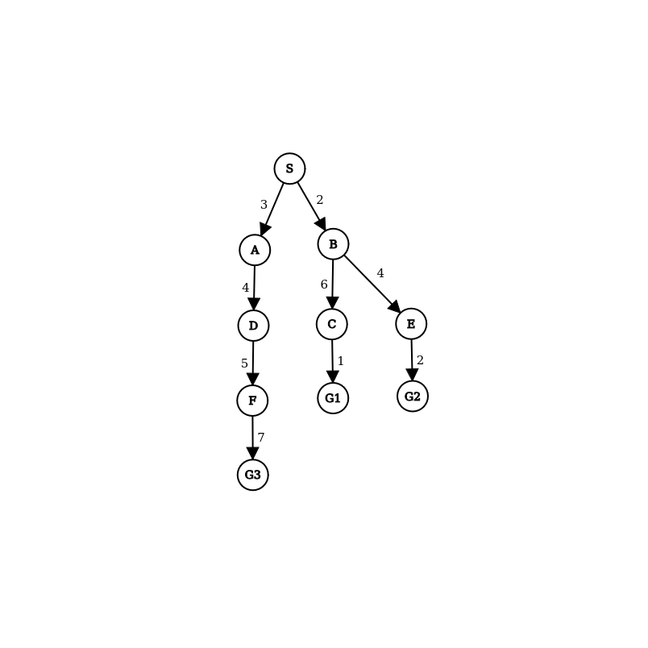
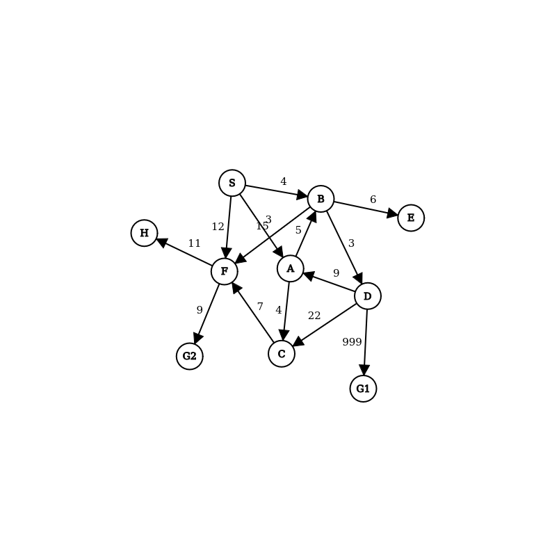

## Whats this ?!
Very unprofesional shortest path algorithms in python.<br />
Will structure this project better in the future.(probably)<br />

### Current Algorithms
- BFS
- DFS
- UCS
- GBFS
- A*

### To Test The Algorithms
If you have nix it will download everything you need<br />
If you dont have it you just need python3 right now (dont mind the racket file)<br />

```bash
cd src/

python3 tests.py #your algorithm of choice from : bfs, dfs, ucs ,gbfs ,astar
```
These are the graphs to be tested on<br />


